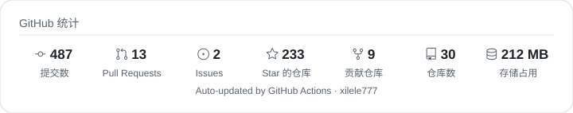
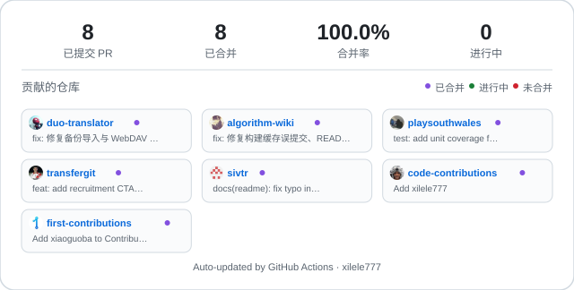

## 🛠️ 技术栈

**全栈 · Full-Stack**

**工程化 · Engineering**

**云平台 · Cloud**

**AI 工具 & 社区 · AI & Community**

---

  <a href="https://github.com/xilele777">
    <picture>
      <source media="(prefers-color-scheme: dark)" srcset="profile/github-stats-dark.svg">
      
    </picture>
  </a>

  

## 🤝 开源贡献

  <a href="https://github.com/pulls?q=author%3Axilele777+is%3Apr">
    <picture>
      <source media="(prefers-color-scheme: dark)" srcset="profile/pr-contributions-dark.svg">
      
    </picture>
  </a>

## 📫 联系我

  
  
  
  

<!-- Wave Footer -->

